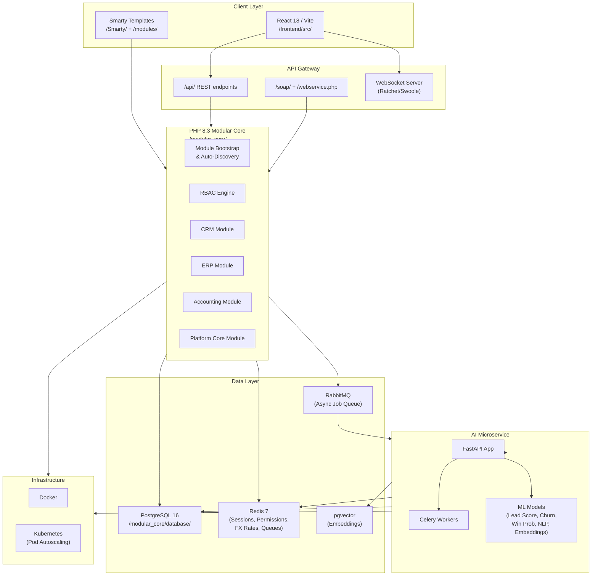
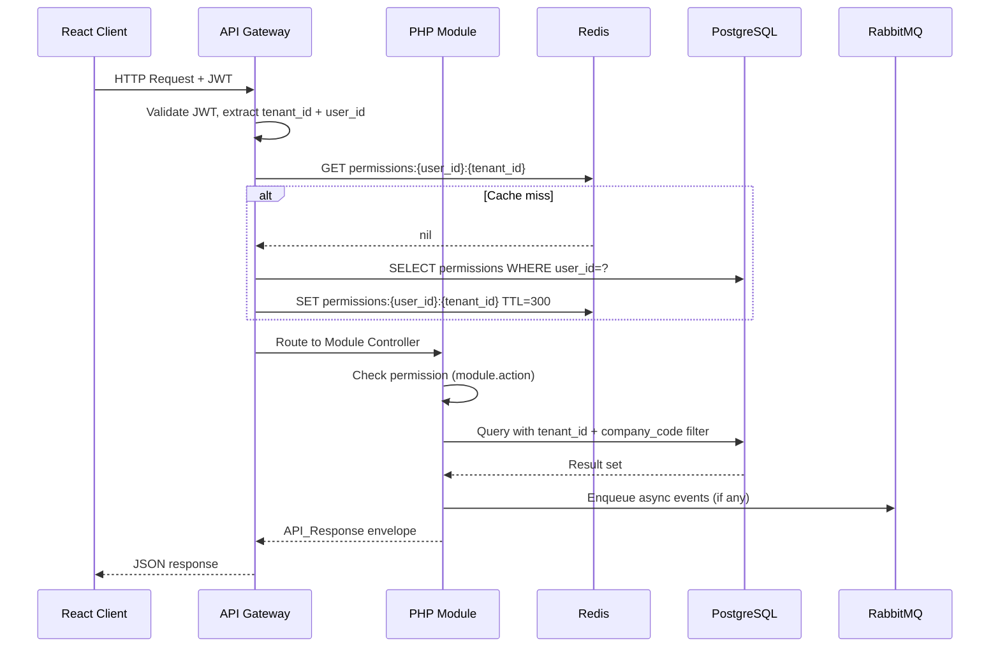
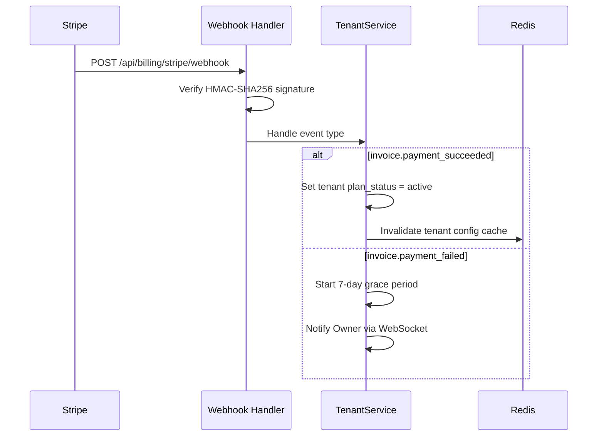
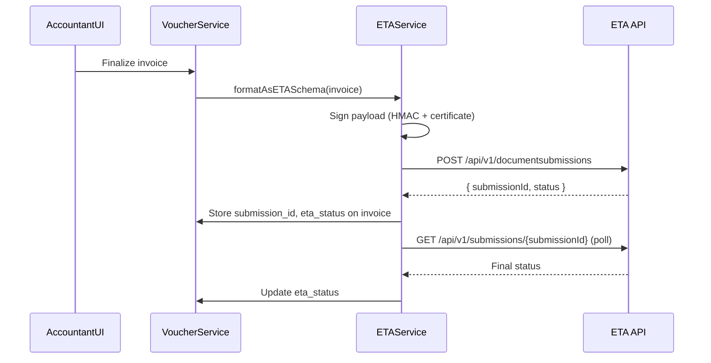
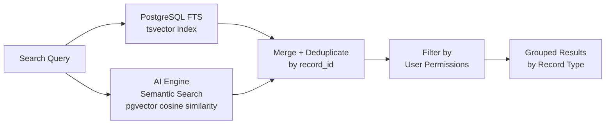
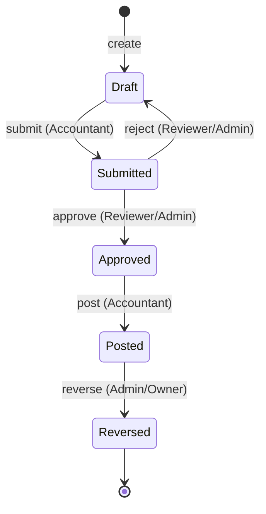

# NexSaaS Modular CRM/ERP/Accounting Platform — Design Document

## Overview

NexSaaS is an enterprise-grade, multi-tenant AI Revenue Operating System. It unifies a full CRM, ERP, and Accounting platform under a single modular PHP 8.3 MVC backend, a Python 3.11 FastAPI AI microservice, and a React 18/Vite frontend. The platform supports strict multi-tenancy, RBAC, 6 companies under one tenant, 6 currencies, a 35-field double-entry journal engine, and AI-powered analytics across all modules.

### Design Goals

- Every data layer is tenant-isolated and company-scoped
- All money is DECIMAL(15,2); exchange rates DECIMAL(10,6); never float
- Every table carries: id BIGSERIAL, company_code VARCHAR(2), tenant_id UUID, created_by, created_at, updated_at, deleted_at
- Financial period is VARCHAR(6) YYYYMM; voucher codes 1–6 by currency, 999 for settlements
- All API responses follow the standard envelope: { success, data, error, meta }
- Bilingual (Arabic RTL + English LTR) output on all Smarty templates and PDF reports

---

## Architecture

### High-Level System Diagram



### Directory Layout

```
/
├── modular_core/
│   ├── bootstrap/          # Module auto-discovery, DI container
│   ├── core/               # BaseModel, BaseController, BaseService, Router
│   ├── database/           # Migrations, seeds, adodb config
│   ├── modules/
│   │   ├── CRM/            # Contacts, Leads, Deals, Accounts, Pipeline, Inbox
│   │   ├── ERP/            # GL, Invoicing, AP, Inventory, HR, Payroll, Projects, MFG
│   │   ├── Accounting/     # COA, Vouchers, FX, AR/AP, Bank, Assets, Payroll, Partners
│   │   └── Platform/       # Auth, RBAC, WebSocket, Billing, Search, Audit, Webhooks
│   └── shared/             # Traits, helpers, validators, PDF engine
├── ai_engine/
│   ├── app/                # FastAPI routes, schemas, services
│   ├── models/             # ML model artifacts
│   ├── workers/            # Celery task definitions
│   └── embeddings/         # Vector index management
├── frontend/
│   └── src/
│       ├── components/     # Shared UI components, PermissionGate
│       ├── modules/        # CRM, ERP, Accounting, Platform feature modules
│       ├── hooks/          # React Query hooks per module
│       └── lib/            # Zod schemas, API client, i18n
├── api/                    # REST endpoint entry points
├── soap/                   # SOAP service definitions
├── modules/                # Legacy vtiger-based PHP modules
├── Smarty/                 # Smarty template engine + bilingual templates
├── adodb/                  # ADOdb ORM/DB abstraction
└── cron/                   # Scheduled job scripts
```

### Request Lifecycle



---

## Components and Interfaces

### Platform Core Components

#### Module Bootstrap (`/modular_core/bootstrap/`)

- `ModuleRegistry`: Scans `/modular_core/modules/*/module.json`, resolves dependency order (topological sort), registers each module's routes, permissions, and event listeners.
- `module.json` schema: `{ name, version, dependencies[], permissions[], routes[] }`
- On missing dependency: logs error, marks module as disabled, continues bootstrap.

#### Base Classes (`/modular_core/core/`)

```php
abstract class BaseModel {
    // Enforces tenant_id + company_code on all queries via adodb
    // Soft-delete: sets deleted_at, excludes in default scope
    protected string $tenantId;
    protected string $companyCode;
    public function scopeQuery(string $sql, array $params): array;
    public function softDelete(int $id): bool;
}

abstract class BaseController {
    public function respond(mixed $data, ?string $error = null, int $status = 200): Response;
    // Wraps output in API_Response envelope
}

abstract class BaseService {
    // Dependency injection, transaction management
    public function transaction(callable $fn): mixed;
}
```

#### RBAC Engine (`/modular_core/modules/Platform/RBAC/`)

- `RBACService::check(userId, permission)`: checks Redis cache first, falls back to DB.
- `PermissionMiddleware`: applied to every route, returns HTTP 403 on failure.
- Cache key: `permissions:{tenant_id}:{user_id}`, TTL 300s.
- Invalidation: on role/permission change, publish `rbac.invalidate:{user_id}` to Redis pub/sub; all app instances subscribe and delete the key within 5s.

#### Standard API Response

```php
// Every controller response uses this shape
[
    'success'  => bool,
    'data'     => mixed,
    'error'    => string|null,
    'meta'     => [
        'company_code' => string,
        'tenant_id'    => string,
        'user_id'      => string,
        'currency'     => string,
        'fin_period'   => string,
        'timestamp'    => string, // UTC ISO-8601
    ]
]
```

#### Authentication (`/modular_core/modules/Platform/Auth/`)

- JWT: RS256, 15-minute expiry, signed with rotating key (90-day rotation).
- Refresh token: opaque 256-bit random token, 7-day expiry, stored in Redis: `refresh:{token_hash}` → `{user_id, tenant_id, expires_at}`.
- 2FA: TOTP (RFC 6238) via `spomky-labs/otphp`; SMS via configured provider.
- SSO: SAML 2.0 via `onelogin/php-saml`; OAuth 2.0/OIDC via `league/oauth2-client`.

#### WebSocket Server

- Ratchet or Swoole WebSocket server, one connection per authenticated session.
- Channel: `tenant:{tenant_id}:user:{user_id}` — all events for that user pushed here.
- Undelivered notifications stored in Redis list `notifications:pending:{user_id}`, flushed on reconnect.
- Notification retention: PostgreSQL `notifications` table, 90-day TTL enforced by nightly Celery task.

### CRM Module Components

#### Contact Management (`/modular_core/modules/CRM/Contacts/`)

- `ContactService::create(array $data)`: validates email/phone presence, checks for duplicates within tenant, creates record.
- `ContactService::merge(int $survivorId, int $duplicateId)`: transfers all activities, deals, notes; soft-deletes duplicate in a single transaction.
- `ContactService::search(string $query)`: full-text search on name, email, phone, company using PostgreSQL `tsvector` index.
- Custom fields: stored in `contact_custom_fields` JSONB column, schema defined per tenant in `tenant_custom_field_definitions`.

#### Lead Management (`/modular_core/modules/CRM/Leads/`)

- `LeadService::capture(array $data)`: creates lead, enqueues `lead.captured` event.
- `LeadService::convert(int $leadId)`: atomic transaction creating Contact + Account + Deal; rolls back all on any failure.
- `LeadFormBuilder`: generates embeddable HTML form with CSRF token; submissions POST to `/api/leads/capture`.
- CSV import: `LeadImportJob` (Celery) processes file, maps fields, detects duplicates by email/phone.

#### Lead Scoring (`/modular_core/modules/CRM/LeadScoring/`)

- On `lead.captured` / `lead.updated` events: enqueue `lead.score_request` to RabbitMQ within 5s.
- AI Engine `/predict/lead-score` returns `{ result: { score: int }, confidence: float, model_version: string }`.
- `LeadScoringService::applyScore(int $leadId, int $score)`: persists score + `score_updated_at`; if delta > 20, pushes WebSocket notification.

#### Pipeline and Deal Management (`/modular_core/modules/CRM/Pipeline/`)

- `PipelineService`: CRUD for pipelines and stages; enforces ordered stage list.
- `DealService::moveStage(int $dealId, int $stageId, int $userId)`: records transition in `deal_stage_history`.
- `DealService::computeForecast(int $pipelineId)`: `SUM(value * win_probability)` per pipeline.
- Deal rotting: nightly Celery task scans deals with `last_activity_at < NOW() - INTERVAL '{rot_days} days'`, sets `is_stale = true`.
- Overdue check: same task marks deals where `close_date < NOW()` and stage not closed.

#### Omnichannel Inbox (`/modular_core/modules/CRM/Inbox/`)

- `InboxService`: aggregates messages from email (IMAP/SMTP), SMS (Twilio), WhatsApp (Meta API), live chat (WebSocket), VoIP (SIP).
- Auto-linking: on message receipt, query contacts/leads by sender email or phone; link if match found.
- `ConversationMetricsService`: tracks `first_response_at`, `handle_time`, `resolved_at` per conversation.
- Chat widget: served as `/widget.js`, embeds via `<script>` tag, connects to WebSocket.

#### Workflow Automation (`/modular_core/modules/CRM/Workflows/`)

- `WorkflowEngine::evaluate(string $event, array $context)`: finds matching enabled workflows, enqueues execution jobs.
- `WorkflowExecutor` (Celery): runs actions sequentially, records each step result in `workflow_execution_steps`.
- Retry: exponential backoff (1s, 2s, 4s) up to 3 retries per failed action step.
- Disabled workflows: `is_enabled = false` flag checked before enqueue.

### ERP Module Components

#### General Ledger (`/modular_core/modules/ERP/GL/`)

- `JournalEntryService::post(array $entry)`: validates balance (Σ Dr = Σ Cr), validates period open, auto-assigns voucher/section codes, stores all 35 fields.
- `TrialBalanceService::generate(string $companyCode, string $finPeriod)`: aggregates debit/credit per account.
- `FinancialStatementService`: generates P&L, Balance Sheet, Cash Flow from COA classifications.
- Period management: `FinPeriodService::close(string $companyCode, string $period)` sets `is_closed = true`; all subsequent posts to that period rejected.

#### Invoicing and AR (`/modular_core/modules/ERP/Invoicing/`)

- `InvoiceService::finalize(int $invoiceId)`: generates PDF (mPDF), sends via SMTP, posts AR journal entry.
- `PaymentService::record(int $invoiceId, array $payment)`: updates outstanding balance, posts journal entry.
- Stripe integration: webhook handler at `/api/billing/stripe/webhook` processes `invoice.payment_succeeded`.
- Recurring invoices: Celery task `RecurringInvoiceTask` runs daily, generates due invoices.

#### Inventory (`/modular_core/modules/ERP/Inventory/`)

- `StockMovementService::record(array $movement)`: updates `inventory_stock` quantities, appends immutable `stock_ledger` entry.
- Valuation: `InventoryValuationService` supports FIFO, LIFO, weighted average per tenant config.
- Reorder alerts: nightly task compares `on_hand_qty` to `reorder_point`, creates alerts and optionally POs.

#### HR and Payroll (`/modular_core/modules/ERP/HR/`)

- `PayrollRunService::compute(string $companyCode, string $finPeriod)`: iterates active employees, applies salary components, deductions, tax tables; posts journal entry.
- Negative net pay: flagged, excluded from finalization.
- Payslip: bilingual PDF generated per employee via mPDF with Arabic RTL + English LTR sections.

### Accounting Module Components

#### COA Management (`/modular_core/modules/Accounting/COA/`)

- 5-level hierarchy stored as adjacency list with `level` (1–5) and `parent_account_code`.
- `COAService::merge(string $source, string $target)`: transfers all journal lines, blocks source account.
- Allocation engine: `AllocationService::distribute(int $journalLineId)`: on posting to allocation account, creates distribution lines to target accounts by configured ratios.
- WIP stale check: Celery task flags WIP accounts with no movement > 90 days.

#### Voucher Engine (`/modular_core/modules/Accounting/Vouchers/`)

- `VoucherService::save(array $voucher)`: validates period open, validates balance, auto-assigns codes, stores all 35 fields.
- Approval workflow: state machine `Draft → Submitted → Approved → Posted → Reversed`.
- Reversal: `VoucherService::reverse(int $voucherId)`: creates equal-and-opposite voucher, links via `reversed_by_voucher_id`.
- Bilingual PDF: mPDF with Arabic RTL section + English LTR section, company letterhead.
- Bulk import: `VoucherImportJob` validates all 35 fields per row, reports row-level errors before commit.

#### FX Engine (`/modular_core/modules/Accounting/FX/`)

- Rate cache: Redis key `fx:rate:{currency_code}:{date}`, TTL 24h, refreshed at midnight by `FXRateRefreshTask`.
- `FXService::getRateForDate(string $currencyCode, string $date)`: Redis-first, falls back to DB.
- Realized gain/loss: `FXService::computeRealizedGainLoss(int $invoiceId, int $paymentId)`.
- Unrealized revaluation: `FXRevaluationTask` runs at period close, posts revaluation entries, schedules auto-reversal.

#### AI Microservice Components (`/ai_engine/`)

- `LeadScoreService`: gradient boosted model on demographic + behavioral features.
- `WinProbabilityService`: logistic regression on deal stage, value, age, historical win rate.
- `ChurnPredictionService`: survival analysis model on engagement, recency, support volume.
- `SentimentService`: transformer-based NLP (multilingual BERT) for Arabic + English.
- `EmbeddingService`: sentence-transformers for semantic search; vectors stored in pgvector.
- `AnomalyDetectionService`: statistical outlier detection on journal entry amounts.
- `ForecastService`: ARIMA/Prophet for revenue and cash flow forecasting.
- All endpoints: `POST /predict/{model}` with body `{ tenant_id, payload }`, response `{ result, confidence, model_version }`.

### Frontend Components (`/frontend/src/`)

#### Core Patterns

- **React Query**: all server state via `useQuery` / `useMutation` hooks per module.
- **React Hook Form + Zod**: all forms validated client-side before submission.
- **PermissionGate**: wraps any UI element; hides/disables based on user's resolved permissions.

```tsx
// PermissionGate usage
<PermissionGate permission="accounting.voucher.create">
  <VoucherForm />
</PermissionGate>
```

- **i18n**: `react-i18next` with locale files per module; RTL layout toggled via `dir="rtl"` on `<html>` for Arabic.
- **WebSocket**: global `useNotifications()` hook maintains WS connection, dispatches to notification store.

#### Module Structure

Each frontend module under `/frontend/src/modules/{ModuleName}/` contains:
- `pages/` — route-level page components
- `components/` — module-specific UI components
- `hooks/` — React Query hooks (`useContacts`, `useDeals`, etc.)
- `schemas/` — Zod validation schemas mirroring backend schemas
- `api/` — typed API client functions

---

## Data Models

### Universal Table Columns

Every table includes:

```sql
id          BIGSERIAL PRIMARY KEY,
company_code VARCHAR(2) NOT NULL,          -- '01'–'06'
tenant_id   UUID NOT NULL,
created_by  BIGINT REFERENCES users(id),
created_at  TIMESTAMPTZ NOT NULL DEFAULT NOW(),
updated_at  TIMESTAMPTZ NOT NULL DEFAULT NOW(),
deleted_at  TIMESTAMPTZ                    -- NULL = active (soft delete)
```

### Platform Tables

```sql
-- tenants
CREATE TABLE tenants (
    id          BIGSERIAL PRIMARY KEY,
    tenant_id   UUID UNIQUE NOT NULL DEFAULT gen_random_uuid(),
    name        VARCHAR(255) NOT NULL,
    plan        VARCHAR(50) NOT NULL,
    stripe_customer_id VARCHAR(100),
    seat_limit  INT NOT NULL DEFAULT 5,
    is_active   BOOLEAN NOT NULL DEFAULT true,
    e_invoice_active BOOLEAN NOT NULL DEFAULT false,
    created_at  TIMESTAMPTZ NOT NULL DEFAULT NOW(),
    updated_at  TIMESTAMPTZ NOT NULL DEFAULT NOW()
);

-- users
CREATE TABLE users (
    id          BIGSERIAL PRIMARY KEY,
    tenant_id   UUID NOT NULL REFERENCES tenants(tenant_id),
    company_code VARCHAR(2) NOT NULL DEFAULT '01',
    email       VARCHAR(255) NOT NULL,
    password_hash VARCHAR(255) NOT NULL,  -- bcrypt cost 12
    full_name   VARCHAR(255) NOT NULL,
    platform_role VARCHAR(20) NOT NULL,   -- Owner|Admin|Manager|Agent|Support
    accounting_role VARCHAR(20),          -- Owner|Admin|Accountant|Reviewer|Viewer
    totp_secret VARCHAR(100),
    is_active   BOOLEAN NOT NULL DEFAULT true,
    created_by  BIGINT,
    created_at  TIMESTAMPTZ NOT NULL DEFAULT NOW(),
    updated_at  TIMESTAMPTZ NOT NULL DEFAULT NOW(),
    deleted_at  TIMESTAMPTZ,
    UNIQUE(tenant_id, email)
);

-- permissions
CREATE TABLE role_permissions (
    id          BIGSERIAL PRIMARY KEY,
    tenant_id   UUID NOT NULL,
    company_code VARCHAR(2) NOT NULL DEFAULT '01',
    role        VARCHAR(20) NOT NULL,
    permission  VARCHAR(100) NOT NULL,    -- module.action format
    created_by  BIGINT,
    created_at  TIMESTAMPTZ NOT NULL DEFAULT NOW(),
    updated_at  TIMESTAMPTZ NOT NULL DEFAULT NOW(),
    deleted_at  TIMESTAMPTZ,
    UNIQUE(tenant_id, role, permission)
);

-- audit_log (append-only, no UPDATE/DELETE allowed via row-level security)
CREATE TABLE audit_log (
    id          BIGSERIAL PRIMARY KEY,
    tenant_id   UUID NOT NULL,
    company_code VARCHAR(2) NOT NULL DEFAULT '01',
    user_id     BIGINT NOT NULL,
    operation   VARCHAR(20) NOT NULL,     -- create|update|delete|permission_change
    table_name  VARCHAR(100) NOT NULL,
    record_id   BIGINT NOT NULL,
    prev_values JSONB,
    new_values  JSONB,
    ip_address  INET,
    created_at  TIMESTAMPTZ NOT NULL DEFAULT NOW()
    -- NO updated_at, deleted_at — immutable
);

-- notifications
CREATE TABLE notifications (
    id          BIGSERIAL PRIMARY KEY,
    tenant_id   UUID NOT NULL,
    company_code VARCHAR(2) NOT NULL DEFAULT '01',
    user_id     BIGINT NOT NULL,
    type        VARCHAR(50) NOT NULL,
    payload     JSONB NOT NULL,
    is_read     BOOLEAN NOT NULL DEFAULT false,
    delivered_at TIMESTAMPTZ,
    created_by  BIGINT,
    created_at  TIMESTAMPTZ NOT NULL DEFAULT NOW(),
    updated_at  TIMESTAMPTZ NOT NULL DEFAULT NOW(),
    deleted_at  TIMESTAMPTZ
);
```

### CRM Tables

```sql
-- contacts
CREATE TABLE contacts (
    id          BIGSERIAL PRIMARY KEY,
    tenant_id   UUID NOT NULL,
    company_code VARCHAR(2) NOT NULL DEFAULT '01',
    full_name   VARCHAR(255) NOT NULL,
    emails      JSONB NOT NULL DEFAULT '[]',   -- [{email, is_primary}]
    phones      JSONB NOT NULL DEFAULT '[]',   -- [{phone, type}]
    company     VARCHAR(255),
    job_title   VARCHAR(255),
    tags        TEXT[] DEFAULT '{}',
    owner_id    BIGINT REFERENCES users(id),
    custom_fields JSONB DEFAULT '{}',
    search_vector TSVECTOR,                    -- updated by trigger
    created_by  BIGINT,
    created_at  TIMESTAMPTZ NOT NULL DEFAULT NOW(),
    updated_at  TIMESTAMPTZ NOT NULL DEFAULT NOW(),
    deleted_at  TIMESTAMPTZ
);
CREATE INDEX idx_contacts_tenant ON contacts(tenant_id) WHERE deleted_at IS NULL;
CREATE INDEX idx_contacts_search ON contacts USING GIN(search_vector);

-- leads
CREATE TABLE leads (
    id          BIGSERIAL PRIMARY KEY,
    tenant_id   UUID NOT NULL,
    company_code VARCHAR(2) NOT NULL DEFAULT '01',
    full_name   VARCHAR(255) NOT NULL,
    email       VARCHAR(255),
    phone       VARCHAR(50),
    source      VARCHAR(50) NOT NULL,          -- web_form|api|import|manual
    status      VARCHAR(30) NOT NULL DEFAULT 'new',
    owner_id    BIGINT REFERENCES users(id),
    lead_score  SMALLINT CHECK(lead_score BETWEEN 0 AND 100),
    score_updated_at TIMESTAMPTZ,
    converted_at TIMESTAMPTZ,
    converted_contact_id BIGINT,
    converted_account_id BIGINT,
    converted_deal_id BIGINT,
    created_by  BIGINT,
    created_at  TIMESTAMPTZ NOT NULL DEFAULT NOW(),
    updated_at  TIMESTAMPTZ NOT NULL DEFAULT NOW(),
    deleted_at  TIMESTAMPTZ
);

-- accounts
CREATE TABLE accounts (
    id          BIGSERIAL PRIMARY KEY,
    tenant_id   UUID NOT NULL,
    company_code VARCHAR(2) NOT NULL DEFAULT '01',
    company_name VARCHAR(255) NOT NULL,
    industry    VARCHAR(100),
    website     VARCHAR(255),
    billing_address JSONB,
    parent_account_id BIGINT REFERENCES accounts(id),
    hierarchy_depth SMALLINT NOT NULL DEFAULT 0,
    owner_id    BIGINT REFERENCES users(id),
    churn_score SMALLINT CHECK(churn_score BETWEEN 0 AND 100),
    churn_score_updated_at TIMESTAMPTZ,
    created_by  BIGINT,
    created_at  TIMESTAMPTZ NOT NULL DEFAULT NOW(),
    updated_at  TIMESTAMPTZ NOT NULL DEFAULT NOW(),
    deleted_at  TIMESTAMPTZ
);

-- pipelines and stages
CREATE TABLE pipelines (
    id          BIGSERIAL PRIMARY KEY,
    tenant_id   UUID NOT NULL,
    company_code VARCHAR(2) NOT NULL DEFAULT '01',
    name        VARCHAR(100) NOT NULL,
    created_by  BIGINT,
    created_at  TIMESTAMPTZ NOT NULL DEFAULT NOW(),
    updated_at  TIMESTAMPTZ NOT NULL DEFAULT NOW(),
    deleted_at  TIMESTAMPTZ
);

CREATE TABLE pipeline_stages (
    id          BIGSERIAL PRIMARY KEY,
    tenant_id   UUID NOT NULL,
    company_code VARCHAR(2) NOT NULL DEFAULT '01',
    pipeline_id BIGINT NOT NULL REFERENCES pipelines(id),
    name        VARCHAR(100) NOT NULL,
    position    SMALLINT NOT NULL,
    is_closed_won BOOLEAN NOT NULL DEFAULT false,
    is_closed_lost BOOLEAN NOT NULL DEFAULT false,
    created_by  BIGINT,
    created_at  TIMESTAMPTZ NOT NULL DEFAULT NOW(),
    updated_at  TIMESTAMPTZ NOT NULL DEFAULT NOW(),
    deleted_at  TIMESTAMPTZ
);

-- deals
CREATE TABLE deals (
    id          BIGSERIAL PRIMARY KEY,
    tenant_id   UUID NOT NULL,
    company_code VARCHAR(2) NOT NULL DEFAULT '01',
    title       VARCHAR(255) NOT NULL,
    value       DECIMAL(15,2) NOT NULL DEFAULT 0,
    currency_code VARCHAR(3) NOT NULL DEFAULT 'EGP',
    pipeline_id BIGINT NOT NULL REFERENCES pipelines(id),
    stage_id    BIGINT NOT NULL REFERENCES pipeline_stages(id),
    close_date  DATE,
    probability DECIMAL(5,2),                  -- manual
    win_probability DECIMAL(5,4),              -- AI predicted 0.0000–1.0000
    win_probability_updated_at TIMESTAMPTZ,
    owner_id    BIGINT REFERENCES users(id),
    contact_id  BIGINT REFERENCES contacts(id),
    account_id  BIGINT REFERENCES accounts(id),
    is_overdue  BOOLEAN NOT NULL DEFAULT false,
    is_stale    BOOLEAN NOT NULL DEFAULT false,
    last_activity_at TIMESTAMPTZ,
    created_by  BIGINT,
    created_at  TIMESTAMPTZ NOT NULL DEFAULT NOW(),
    updated_at  TIMESTAMPTZ NOT NULL DEFAULT NOW(),
    deleted_at  TIMESTAMPTZ
);

-- inbox conversations and messages
CREATE TABLE inbox_conversations (
    id          BIGSERIAL PRIMARY KEY,
    tenant_id   UUID NOT NULL,
    company_code VARCHAR(2) NOT NULL DEFAULT '01',
    channel     VARCHAR(20) NOT NULL,          -- email|sms|whatsapp|chat|voip
    contact_id  BIGINT REFERENCES contacts(id),
    lead_id     BIGINT REFERENCES leads(id),
    assigned_agent_id BIGINT REFERENCES users(id),
    status      VARCHAR(20) NOT NULL DEFAULT 'open',
    first_response_at TIMESTAMPTZ,
    resolved_at TIMESTAMPTZ,
    created_by  BIGINT,
    created_at  TIMESTAMPTZ NOT NULL DEFAULT NOW(),
    updated_at  TIMESTAMPTZ NOT NULL DEFAULT NOW(),
    deleted_at  TIMESTAMPTZ
);

CREATE TABLE inbox_messages (
    id          BIGSERIAL PRIMARY KEY,
    tenant_id   UUID NOT NULL,
    company_code VARCHAR(2) NOT NULL DEFAULT '01',
    conversation_id BIGINT NOT NULL REFERENCES inbox_conversations(id),
    direction   VARCHAR(10) NOT NULL,          -- inbound|outbound
    body        TEXT NOT NULL,
    sentiment   VARCHAR(10),                   -- positive|neutral|negative
    sentiment_confidence DECIMAL(4,3),
    created_by  BIGINT,
    created_at  TIMESTAMPTZ NOT NULL DEFAULT NOW(),
    updated_at  TIMESTAMPTZ NOT NULL DEFAULT NOW(),
    deleted_at  TIMESTAMPTZ
);
```

### Accounting Core Tables

```sql
-- chart_of_accounts
CREATE TABLE chart_of_accounts (
    id              BIGSERIAL PRIMARY KEY,
    tenant_id       UUID NOT NULL,
    company_code    VARCHAR(2) NOT NULL,
    account_code    VARCHAR(20) NOT NULL,
    account_desc    VARCHAR(255) NOT NULL,
    account_desc_ar VARCHAR(255),
    account_type    VARCHAR(20) NOT NULL,  -- Asset|Liability|Equity|Income|Expense|Cost|Allocation
    level           SMALLINT NOT NULL CHECK(level BETWEEN 1 AND 5),
    parent_account_code VARCHAR(20),
    allowed_currencies VARCHAR(2)[] DEFAULT '{}',  -- empty = all
    allowed_companies  VARCHAR(2)[] DEFAULT '{}',  -- empty = all
    is_blocked      BOOLEAN NOT NULL DEFAULT false,
    profit_loss_flag VARCHAR(1),
    income_stmt_flag VARCHAR(1),
    created_by      BIGINT,
    created_at      TIMESTAMPTZ NOT NULL DEFAULT NOW(),
    updated_at      TIMESTAMPTZ NOT NULL DEFAULT NOW(),
    deleted_at      TIMESTAMPTZ,
    UNIQUE(tenant_id, company_code, account_code)
);

-- financial_periods
CREATE TABLE financial_periods (
    id              BIGSERIAL PRIMARY KEY,
    tenant_id       UUID NOT NULL,
    company_code    VARCHAR(2) NOT NULL,
    fin_period      VARCHAR(6) NOT NULL,   -- YYYYMM
    is_open         BOOLEAN NOT NULL DEFAULT true,
    is_locked       BOOLEAN NOT NULL DEFAULT false,
    closed_at       TIMESTAMPTZ,
    closed_by       BIGINT,
    created_by      BIGINT,
    created_at      TIMESTAMPTZ NOT NULL DEFAULT NOW(),
    updated_at      TIMESTAMPTZ NOT NULL DEFAULT NOW(),
    deleted_at      TIMESTAMPTZ,
    UNIQUE(tenant_id, company_code, fin_period)
);

-- journal_entries (header)
CREATE TABLE journal_entries (
    id              BIGSERIAL PRIMARY KEY,
    tenant_id       UUID NOT NULL,
    company_code    VARCHAR(2) NOT NULL,
    fin_period      VARCHAR(6) NOT NULL,
    voucher_date    DATE NOT NULL,
    voucher_no      VARCHAR(30) NOT NULL,
    voucher_code    SMALLINT NOT NULL,     -- 1-6 or 999
    section_code    VARCHAR(3) NOT NULL,   -- 01|02|991-996
    status          VARCHAR(20) NOT NULL DEFAULT 'draft',  -- draft|submitted|approved|posted|reversed
    is_intercompany BOOLEAN NOT NULL DEFAULT false,
    reversed_by_id  BIGINT REFERENCES journal_entries(id),
    is_opening_balance BOOLEAN NOT NULL DEFAULT false,
    created_by      BIGINT,
    created_at      TIMESTAMPTZ NOT NULL DEFAULT NOW(),
    updated_at      TIMESTAMPTZ NOT NULL DEFAULT NOW(),
    deleted_at      TIMESTAMPTZ
);

-- journal_entry_lines (all 35 fields)
CREATE TABLE journal_entry_lines (
    id                  BIGSERIAL PRIMARY KEY,
    tenant_id           UUID NOT NULL,
    company_code        VARCHAR(2) NOT NULL,
    journal_entry_id    BIGINT NOT NULL REFERENCES journal_entries(id),
    area_code           VARCHAR(10),
    area_desc           VARCHAR(255),
    fin_period          VARCHAR(6) NOT NULL,
    voucher_date        DATE NOT NULL,
    service_date        VARCHAR(6),            -- YYYYMM
    voucher_no          VARCHAR(30) NOT NULL,
    section_code        VARCHAR(3) NOT NULL,
    voucher_sub         VARCHAR(10),
    line_no             SMALLINT NOT NULL,
    account_code        VARCHAR(20) NOT NULL,
    account_desc        VARCHAR(255),
    cost_identifier     VARCHAR(255),
    cost_center_code    VARCHAR(20),
    cost_center_name    VARCHAR(255),
    vendor_code         VARCHAR(20),
    vendor_name         VARCHAR(255),
    check_transfer_no   VARCHAR(50),
    exchange_rate       DECIMAL(10,6) NOT NULL DEFAULT 1.000000,
    currency_code       VARCHAR(2) NOT NULL,   -- 01-06
    dr_value            DECIMAL(15,2) NOT NULL DEFAULT 0,
    cr_value            DECIMAL(15,2) NOT NULL DEFAULT 0,
    dr_value_egp        DECIMAL(15,2) NOT NULL DEFAULT 0,
    cr_value_egp        DECIMAL(15,2) NOT NULL DEFAULT 0,
    line_desc           TEXT,
    asset_no            VARCHAR(30),
    transaction_no      VARCHAR(50),
    profit_loss_flag    VARCHAR(1),
    customer_invoice_no VARCHAR(50),
    income_stmt_flag    VARCHAR(1),
    internal_invoice_no VARCHAR(50),
    employee_no         VARCHAR(20),
    partner_no          VARCHAR(20),
    vendor_word_count   INT DEFAULT 0,
    translator_word_count INT DEFAULT 0,
    agent_name          VARCHAR(255),
    created_by          BIGINT,
    created_at          TIMESTAMPTZ NOT NULL DEFAULT NOW(),
    updated_at          TIMESTAMPTZ NOT NULL DEFAULT NOW(),
    deleted_at          TIMESTAMPTZ
);
CREATE INDEX idx_jel_tenant_company ON journal_entry_lines(tenant_id, company_code) WHERE deleted_at IS NULL;
CREATE INDEX idx_jel_fin_period ON journal_entry_lines(tenant_id, company_code, fin_period) WHERE deleted_at IS NULL;
CREATE INDEX idx_jel_account ON journal_entry_lines(tenant_id, company_code, account_code) WHERE deleted_at IS NULL;

-- exchange_rates
CREATE TABLE exchange_rates (
    id              BIGSERIAL PRIMARY KEY,
    tenant_id       UUID NOT NULL,
    company_code    VARCHAR(2) NOT NULL DEFAULT '01',
    currency_code   VARCHAR(2) NOT NULL,
    rate_date       DATE NOT NULL,
    rate            DECIMAL(10,6) NOT NULL,
    source          VARCHAR(20) NOT NULL DEFAULT 'manual',  -- manual|cbe_api
    created_by      BIGINT,
    created_at      TIMESTAMPTZ NOT NULL DEFAULT NOW(),
    updated_at      TIMESTAMPTZ NOT NULL DEFAULT NOW(),
    deleted_at      TIMESTAMPTZ,
    UNIQUE(tenant_id, currency_code, rate_date)
);
```

### Additional Accounting Tables

```sql
-- bank_accounts
CREATE TABLE bank_accounts (
    id              BIGSERIAL PRIMARY KEY,
    tenant_id       UUID NOT NULL,
    company_code    VARCHAR(2) NOT NULL,
    account_name    VARCHAR(255) NOT NULL,
    currency_code   VARCHAR(2) NOT NULL,
    coa_account_code VARCHAR(20) NOT NULL,
    is_active       BOOLEAN NOT NULL DEFAULT true,
    created_by      BIGINT,
    created_at      TIMESTAMPTZ NOT NULL DEFAULT NOW(),
    updated_at      TIMESTAMPTZ NOT NULL DEFAULT NOW(),
    deleted_at      TIMESTAMPTZ
);

-- fixed_assets
CREATE TABLE fixed_assets (
    id              BIGSERIAL PRIMARY KEY,
    tenant_id       UUID NOT NULL,
    company_code    VARCHAR(2) NOT NULL,
    asset_no        VARCHAR(30) NOT NULL,
    asset_name      VARCHAR(255) NOT NULL,
    category        VARCHAR(100) NOT NULL,
    acquisition_date DATE NOT NULL,
    cost            DECIMAL(15,2) NOT NULL,
    salvage_value   DECIMAL(15,2) NOT NULL DEFAULT 0,
    useful_life_months SMALLINT NOT NULL,
    depreciation_method VARCHAR(20) NOT NULL DEFAULT 'straight_line',
    accumulated_depreciation DECIMAL(15,2) NOT NULL DEFAULT 0,
    net_book_value  DECIMAL(15,2) NOT NULL,
    status          VARCHAR(20) NOT NULL DEFAULT 'active',  -- active|retired
    coa_account_code VARCHAR(20) NOT NULL,
    created_by      BIGINT,
    created_at      TIMESTAMPTZ NOT NULL DEFAULT NOW(),
    updated_at      TIMESTAMPTZ NOT NULL DEFAULT NOW(),
    deleted_at      TIMESTAMPTZ,
    UNIQUE(tenant_id, company_code, asset_no)
);

-- cost_centers
CREATE TABLE cost_centers (
    id              BIGSERIAL PRIMARY KEY,
    tenant_id       UUID NOT NULL,
    company_code    VARCHAR(2) NOT NULL,
    cost_center_code VARCHAR(20) NOT NULL,
    cost_center_name VARCHAR(255) NOT NULL,
    cost_center_name_ar VARCHAR(255),
    parent_code     VARCHAR(20),
    created_by      BIGINT,
    created_at      TIMESTAMPTZ NOT NULL DEFAULT NOW(),
    updated_at      TIMESTAMPTZ NOT NULL DEFAULT NOW(),
    deleted_at      TIMESTAMPTZ,
    UNIQUE(tenant_id, company_code, cost_center_code)
);

-- partners
CREATE TABLE partners (
    id              BIGSERIAL PRIMARY KEY,
    tenant_id       UUID NOT NULL,
    company_code    VARCHAR(2) NOT NULL,
    partner_code    VARCHAR(20) NOT NULL,
    partner_name    VARCHAR(255) NOT NULL,
    share_pct       DECIMAL(5,4) NOT NULL,     -- e.g. 0.5000 = 50%
    withdrawal_approval_threshold DECIMAL(15,2),
    created_by      BIGINT,
    created_at      TIMESTAMPTZ NOT NULL DEFAULT NOW(),
    updated_at      TIMESTAMPTZ NOT NULL DEFAULT NOW(),
    deleted_at      TIMESTAMPTZ,
    UNIQUE(tenant_id, company_code, partner_code)
);

-- payroll_runs
CREATE TABLE payroll_runs (
    id              BIGSERIAL PRIMARY KEY,
    tenant_id       UUID NOT NULL,
    company_code    VARCHAR(2) NOT NULL,
    fin_period      VARCHAR(6) NOT NULL,
    status          VARCHAR(20) NOT NULL DEFAULT 'draft',
    total_gross     DECIMAL(15,2) NOT NULL DEFAULT 0,
    total_deductions DECIMAL(15,2) NOT NULL DEFAULT 0,
    total_net       DECIMAL(15,2) NOT NULL DEFAULT 0,
    journal_entry_id BIGINT REFERENCES journal_entries(id),
    created_by      BIGINT,
    created_at      TIMESTAMPTZ NOT NULL DEFAULT NOW(),
    updated_at      TIMESTAMPTZ NOT NULL DEFAULT NOW(),
    deleted_at      TIMESTAMPTZ
);

-- payroll_lines
CREATE TABLE payroll_lines (
    id              BIGSERIAL PRIMARY KEY,
    tenant_id       UUID NOT NULL,
    company_code    VARCHAR(2) NOT NULL,
    payroll_run_id  BIGINT NOT NULL REFERENCES payroll_runs(id),
    employee_no     VARCHAR(20) NOT NULL,
    -- allowances (28 components)
    basic_salary    DECIMAL(15,2) NOT NULL DEFAULT 0,
    production      DECIMAL(15,2) NOT NULL DEFAULT 0,
    incentive_bonus DECIMAL(15,2) NOT NULL DEFAULT 0,
    overtime        DECIMAL(15,2) NOT NULL DEFAULT 0,
    annual_profit   DECIMAL(15,2) NOT NULL DEFAULT 0,
    monthly_bonus   DECIMAL(15,2) NOT NULL DEFAULT 0,
    h_cost_of_living DECIMAL(15,2) NOT NULL DEFAULT 0,
    nature_of_work  DECIMAL(15,2) NOT NULL DEFAULT 0,
    represent       DECIMAL(15,2) NOT NULL DEFAULT 0,
    desert          DECIMAL(15,2) NOT NULL DEFAULT 0,
    labour_day      DECIMAL(15,2) NOT NULL DEFAULT 0,
    shift           DECIMAL(15,2) NOT NULL DEFAULT 0,
    experience      DECIMAL(15,2) NOT NULL DEFAULT 0,
    science_grade   DECIMAL(15,2) NOT NULL DEFAULT 0,
    garage          DECIMAL(15,2) NOT NULL DEFAULT 0,
    special_increase DECIMAL(15,2) NOT NULL DEFAULT 0,
    fulltime        DECIMAL(15,2) NOT NULL DEFAULT 0,
    cashier         DECIMAL(15,2) NOT NULL DEFAULT 0,
    merit           DECIMAL(15,2) NOT NULL DEFAULT 0,
    offshore        DECIMAL(15,2) NOT NULL DEFAULT 0,
    radio           DECIMAL(15,2) NOT NULL DEFAULT 0,
    dangers         DECIMAL(15,2) NOT NULL DEFAULT 0,
    drilling        DECIMAL(15,2) NOT NULL DEFAULT 0,
    expatriation    DECIMAL(15,2) NOT NULL DEFAULT 0,
    tender          DECIMAL(15,2) NOT NULL DEFAULT 0,
    committee       DECIMAL(15,2) NOT NULL DEFAULT 0,
    meals           DECIMAL(15,2) NOT NULL DEFAULT 0,
    transportation  DECIMAL(15,2) NOT NULL DEFAULT 0,
    -- deductions (18 components)
    income_tax      DECIMAL(15,2) NOT NULL DEFAULT 0,
    social_insurance DECIMAL(15,2) NOT NULL DEFAULT 0,
    supp_pension    DECIMAL(15,2) NOT NULL DEFAULT 0,
    provident_fund  DECIMAL(15,2) NOT NULL DEFAULT 0,
    retirement_pension DECIMAL(15,2) NOT NULL DEFAULT 0,
    journey         DECIMAL(15,2) NOT NULL DEFAULT 0,
    employee_loan   DECIMAL(15,2) NOT NULL DEFAULT 0,
    school_loan     DECIMAL(15,2) NOT NULL DEFAULT 0,
    mobile_bills    DECIMAL(15,2) NOT NULL DEFAULT 0,
    amusement_park  DECIMAL(15,2) NOT NULL DEFAULT 0,
    summer_resorts  DECIMAL(15,2) NOT NULL DEFAULT 0,
    disability_fund DECIMAL(15,2) NOT NULL DEFAULT 0,
    martyrs_fund    DECIMAL(15,2) NOT NULL DEFAULT 0,
    raya_install    DECIMAL(15,2) NOT NULL DEFAULT 0,
    premium_install DECIMAL(15,2) NOT NULL DEFAULT 0,
    law_170_2020    DECIMAL(15,2) NOT NULL DEFAULT 0,
    riskalla        DECIMAL(15,2) NOT NULL DEFAULT 0,
    other_deductions DECIMAL(15,2) NOT NULL DEFAULT 0,
    -- totals
    gross_pay       DECIMAL(15,2) NOT NULL DEFAULT 0,
    total_deductions DECIMAL(15,2) NOT NULL DEFAULT 0,
    net_pay         DECIMAL(15,2) NOT NULL DEFAULT 0,
    is_flagged      BOOLEAN NOT NULL DEFAULT false,
    created_by      BIGINT,
    created_at      TIMESTAMPTZ NOT NULL DEFAULT NOW(),
    updated_at      TIMESTAMPTZ NOT NULL DEFAULT NOW(),
    deleted_at      TIMESTAMPTZ
);

-- embeddings (pgvector)
CREATE EXTENSION IF NOT EXISTS vector;
CREATE TABLE record_embeddings (
    id              BIGSERIAL PRIMARY KEY,
    tenant_id       UUID NOT NULL,
    record_type     VARCHAR(50) NOT NULL,      -- contact|lead|deal|account|note
    record_id       BIGINT NOT NULL,
    embedding       vector(768) NOT NULL,
    model_version   VARCHAR(50) NOT NULL,
    created_at      TIMESTAMPTZ NOT NULL DEFAULT NOW(),
    updated_at      TIMESTAMPTZ NOT NULL DEFAULT NOW(),
    UNIQUE(tenant_id, record_type, record_id)
);
CREATE INDEX idx_embeddings_vector ON record_embeddings USING ivfflat (embedding vector_cosine_ops);
```

---

## Correctness Properties

*A property is a characteristic or behavior that should hold true across all valid executions of a system — essentially, a formal statement about what the system should do. Properties serve as the bridge between human-readable specifications and machine-verifiable correctness guarantees.*

### Property 1: Tenant Data Isolation

*For any* two tenants A and B, executing any query scoped to tenant A must never return records belonging to tenant B, regardless of record type or query parameters.

**Validates: Requirements 1.3, 1.4**

---

### Property 2: Soft Delete Round Trip

*For any* record that is soft-deleted, a standard query (without explicit deleted_at filter) must not return that record, and the record's deleted_at field must be set to a non-null timestamp.

**Validates: Requirements 1.5, 1.6**

---

### Property 3: Standard Table Schema Invariant

*For any* table in the system, it must contain the columns: id, company_code, tenant_id, created_by, created_at, updated_at, deleted_at.

**Validates: Requirements 1.1, 1.2**

---

### Property 4: RBAC Permission Enforcement

*For any* user and any operation, if the user's role does not include the required permission string (module.action), the system must deny the operation and return HTTP 403.

**Validates: Requirements 2.3, 2.4, 2.5**

---

### Property 5: Standard API Response Envelope

*For any* REST API endpoint call, the response must be a JSON object containing exactly: success (boolean), data (any or null), error (string or null), and meta (object with tenant_id, user_id, company_code, currency, fin_period, timestamp). When success is true, error must be null. When success is false, data must be null.

**Validates: Requirements 3.1, 3.2, 3.3, 3.4**

---

### Property 6: AI Engine Response Contract

*For any* AI Engine prediction endpoint call, the response must contain result (any), confidence (float in [0.0, 1.0]), and model_version (non-empty string).

**Validates: Requirements 3.5, 35.2**

---

### Property 7: Contact Requires Email or Phone

*For any* contact creation request where both email and phone are absent or empty, the system must reject the request and return a validation error.

**Validates: Requirements 6.2**

---

### Property 8: Duplicate Contact Detection

*For any* contact creation with an email address that already exists within the same tenant, the system must warn the user and not silently create a duplicate.

**Validates: Requirements 6.3**

---

### Property 9: Contact Merge Completeness

*For any* contact merge operation, all activities, deals, and notes linked to the duplicate record must be transferred to the surviving record, and the duplicate must be soft-deleted.

**Validates: Requirements 6.7**

---

### Property 10: Lead Score Range

*For any* lead score computed by the AI Engine, the score must be an integer in the range [0, 100].

**Validates: Requirements 8.2**

---

### Property 11: Lead Score Change Notification

*For any* lead whose score changes by more than 20 points, a notification must be delivered to the lead owner within 30 seconds.

**Validates: Requirements 8.6**

---

### Property 12: Account Hierarchy Depth Limit

*For any* account hierarchy, the depth from root to leaf must not exceed 5 levels.

**Validates: Requirements 9.4**

---

### Property 13: Weighted Pipeline Forecast Correctness

*For any* pipeline, the computed forecast value must equal the sum of (deal.value × deal.win_probability) for all non-closed deals in that pipeline.

**Validates: Requirements 10.7**

---

### Property 14: Deal Win Probability Range

*For any* win probability returned by the AI Engine, the value must be a float in the range [0.0, 1.0].

**Validates: Requirements 11.2**

---

### Property 15: Workflow Action Ordering

*For any* workflow execution, actions must be executed in the declared sequential order, and each action's result must be recorded before the next action begins.

**Validates: Requirements 14.5**

---

### Property 16: Disabled Workflow Not Executed

*For any* workflow with is_enabled = false, the system must not execute it even if its trigger condition is met.

**Validates: Requirements 14.9**

---

### Property 17: Double-Entry Balance Invariant

*For any* journal entry, the sum of all debit line amounts must equal the sum of all credit line amounts (in both transaction currency and EGP equivalent). Any entry where this invariant does not hold must be rejected.

**Validates: Requirements 18.2, 18.3, 46.6**

---

### Property 18: Voucher Code Assignment

*For any* journal entry, the voucher_code must be automatically assigned based on the transaction currency: EGP→1, USD→2, AED→3, SAR→4, EUR→5, GBP→6, Settlement→999. A voucher with code 999 and section_code 01 or 02 must be rejected.

**Validates: Requirements 18.5, 18.6, 18.7**

---

### Property 19: Company Code Query Isolation

*For any* journal entry query, the query must include an explicit company_code filter. Queries without a company_code filter must be rejected and must not return records from multiple companies.

**Validates: Requirements 18.9**

---

### Property 20: Closed Period Immutability

*For any* financial period that is closed or locked for a given company_code, any attempt to post a new journal entry to that period must be rejected.

**Validates: Requirements 18.13, 46.19, 58.2**

---

### Property 21: Monetary Amount Precision

*For any* monetary amount stored or returned by the system, it must be represented as DECIMAL(15,2) in the database and as a string or fixed-point decimal in JSON — never as a floating-point number.

**Validates: Requirements 18.8, 44.6**

---

### Property 22: API Serialization Round Trip

*For any* valid platform record, serializing the record to JSON and then deserializing the JSON must produce a record equal to the original.

**Validates: Requirements 44.5**

---

### Property 23: Realized FX Gain/Loss Calculation

*For any* foreign-currency invoice settled at a different exchange rate than the invoice date rate, the realized FX gain/loss must equal (settlement_rate − invoice_rate) × transaction_amount, and this amount must be posted to the configured FX gain/loss account.

**Validates: Requirements 47.6**

---

### Property 24: FX Revaluation Round Trip

*For any* unrealized FX revaluation posted at period close, an equal-and-opposite reversal entry must be automatically created and posted on the first day of the next financial period.

**Validates: Requirements 47.7, 47.8**

---

### Property 25: Payroll Negative Net Pay Exclusion

*For any* payroll run, any employee whose computed net pay is negative must be flagged and excluded from finalization; the payroll run must not be finalized while flagged employees remain.

**Validates: Requirements 24.6, 52.13**

---

### Property 26: Partner Profit Distribution Calculation

*For any* closed financial period, each partner's distribution amount must equal the company's net income for that period multiplied by the partner's configured share_pct, and the sum of all partner distributions must equal the total net income.

**Validates: Requirements 53.1**

---

## Error Handling

### Validation Errors (HTTP 422)

All incoming request bodies are validated against declared Zod (frontend) and JSON Schema (backend) schemas. On failure, the system returns:

```json
{
  "success": false,
  "data": null,
  "error": "Validation failed",
  "meta": { ... },
  "errors": {
    "field_name": ["error message"]
  }
}
```

### Authorization Errors (HTTP 403)

```json
{
  "success": false,
  "data": null,
  "error": "Permission denied: accounting.voucher.create required",
  "meta": { ... }
}
```

### Business Rule Violations

- Unbalanced journal entry: HTTP 422 with `"error": "Journal entry debits (X) do not equal credits (Y)"`
- Closed period posting: HTTP 422 with `"error": "Financial period YYYYMM is closed for company XX"`
- Voucher 999 with section 01/02: HTTP 422 with `"error": "Settlement voucher (999) cannot use section codes 01 or 02"`
- Missing company_code filter: HTTP 400 with `"error": "company_code filter is required for journal entry queries"`
- Negative net pay: payroll finalization blocked with per-employee error list

### Async Job Failures

- Workflow action failures: retry 3× with exponential backoff (1s, 2s, 4s); mark execution as `failed` after exhaustion; notify workflow owner via WebSocket.
- Webhook delivery failures: retry 5× with exponential backoff over 24 hours; record each attempt with status + response body.
- Email sync failures: notify owning user via in-app notification; log error with retry details.
- AI Engine unavailability: PHP backend enqueues request to RabbitMQ dead-letter queue; retries when AI Engine recovers; returns cached last-known score in the interim.

### Database Errors

- Connection pool exhaustion: return HTTP 503 with `"error": "Service temporarily unavailable"`.
- Deadlock: retry transaction up to 3 times before returning HTTP 500.
- Constraint violations (unique, FK): return HTTP 409 with descriptive error.

### Redis Unavailability

- Permission cache miss: fall back to PostgreSQL query; log `WARN: Redis unavailable, falling back to DB`.
- FX rate cache miss: fall back to `exchange_rates` table; log warning.
- Session unavailability: require re-authentication.

---

## Testing Strategy

### Dual Testing Approach

Both unit tests and property-based tests are required. They are complementary:

- **Unit tests** cover specific examples, integration points, edge cases, and error conditions.
- **Property-based tests** verify universal invariants across randomly generated inputs.

### Unit Testing

**PHP Backend**: PHPUnit 11

- One test class per Service class
- Test specific examples: valid journal entry creation, lead conversion atomicity, payroll run with known inputs
- Test error conditions: unbalanced entry rejection, closed period rejection, missing tenant_id rejection
- Test integration points: Stripe webhook handler, FX rate cache fallback, RBAC middleware

**Python AI Engine**: pytest

- Test each prediction endpoint with known inputs and expected output ranges
- Test error conditions: missing tenant_id (HTTP 400), malformed payload
- Test model versioning: response always includes model_version

**React Frontend**: Vitest + React Testing Library

- Test PermissionGate renders/hides correctly
- Test Zod schema validation rejects invalid inputs
- Test API response envelope parsing
- Test bilingual rendering (RTL for Arabic locale)

### Property-Based Testing

**PHP Backend**: use `eris/eris` (PHP property-based testing library)

**Python AI Engine**: use `hypothesis` library

**React Frontend**: use `fast-check` library

Minimum 100 iterations per property test. Each test is tagged with a comment referencing the design property.

Tag format: `// Feature: nexsaas-modular-crm, Property {N}: {property_text}`

#### Property Test Implementations

**Property 1 — Tenant Data Isolation** (`eris/eris`, PHP)
```
// Feature: nexsaas-modular-crm, Property 1: Tenant data isolation
// Generate two random tenants with random records; query as tenant A; assert no tenant B records returned
forAll(tenantPair(), function($tenantA, $tenantB) {
    $results = $model->query(['tenant_id' => $tenantA->id]);
    foreach ($results as $row) {
        assert($row['tenant_id'] === $tenantA->id);
    }
});
```

**Property 2 — Soft Delete Round Trip** (`eris/eris`, PHP)
```
// Feature: nexsaas-modular-crm, Property 2: Soft delete round trip
// For any record, soft-delete it, then query without deleted_at filter; assert record not in results
forAll(anyRecord(), function($record) {
    $model->softDelete($record->id);
    $results = $model->findAll(['tenant_id' => $record->tenant_id]);
    assert(!in_array($record->id, array_column($results, 'id')));
    $raw = $model->findById($record->id, includeDeleted: true);
    assert($raw['deleted_at'] !== null);
});
```

**Property 17 — Double-Entry Balance Invariant** (`eris/eris`, PHP)
```
// Feature: nexsaas-modular-crm, Property 17: Double-entry balance invariant
// For any set of journal lines, if sum(dr) != sum(cr), posting must be rejected
forAll(journalEntryLines(), function($lines) {
    $dr = array_sum(array_column($lines, 'dr_value'));
    $cr = array_sum(array_column($lines, 'cr_value'));
    if ($dr !== $cr) {
        $result = $voucherService->save(['lines' => $lines]);
        assert($result['success'] === false);
    }
});
```

**Property 18 — Voucher Code Assignment** (`eris/eris`, PHP)
```
// Feature: nexsaas-modular-crm, Property 18: Voucher code assignment
// For any currency code, the assigned voucher_code must match the mapping
forAll(currencyCode(), function($currency) {
    $expected = ['01'=>1,'02'=>2,'03'=>3,'04'=>4,'05'=>5,'06'=>6];
    $entry = $voucherService->buildEntry(['currency_code' => $currency]);
    assert($entry['voucher_code'] === $expected[$currency]);
});
```

**Property 22 — API Serialization Round Trip** (`fast-check`, TypeScript)
```typescript
// Feature: nexsaas-modular-crm, Property 22: API serialization round trip
fc.assert(fc.asyncProperty(fc.record(anyPlatformRecord()), async (record) => {
    const serialized = JSON.stringify(record);
    const deserialized = JSON.parse(serialized);
    expect(deserialized).toEqual(record);
}), { numRuns: 100 });
```

**Property 26 — Partner Profit Distribution** (`hypothesis`, Python)
```python
# Feature: nexsaas-modular-crm, Property 26: Partner profit distribution
@given(
    net_income=st.decimals(min_value=Decimal('0'), max_value=Decimal('9999999999999.99'), places=2),
    partners=st.lists(st.decimals(min_value=Decimal('0.0001'), max_value=Decimal('1'), places=4), min_size=1, max_size=6)
)
@settings(max_examples=100)
def test_partner_distribution_sums_to_net_income(net_income, partners):
    # Normalize shares to sum to 1
    total = sum(partners)
    shares = [p / total for p in partners]
    distributions = [compute_distribution(net_income, share) for share in shares]
    assert sum(distributions) == net_income
```

### Test Configuration

- Property tests: minimum 100 iterations each
- CI pipeline runs all tests on every PR
- Performance tests (500ms p95 API response, 10s report generation) run nightly via k6 load test suite
- Integration tests for Stripe webhooks, ETA e-invoice API, and calendar sync run against sandbox environments

---

## API Design

### REST Endpoint Conventions

All REST endpoints follow the pattern: `/api/v1/{module}/{resource}`

Every endpoint:
1. Requires `Authorization: Bearer {jwt}` header
2. Returns the standard API_Response envelope
3. Requires `X-Company-Code` header for accounting endpoints
4. Validates request body against declared JSON Schema before processing

### Key Endpoint Groups

#### Authentication
```
POST   /api/v1/auth/login              # Returns JWT + refresh token
POST   /api/v1/auth/refresh            # Exchange refresh token for new JWT
POST   /api/v1/auth/logout             # Revoke refresh token
POST   /api/v1/auth/2fa/enroll         # Enroll TOTP, returns QR + backup codes
POST   /api/v1/auth/2fa/verify         # Verify TOTP code
GET    /api/v1/auth/sso/{provider}     # Initiate SSO flow
POST   /api/v1/auth/sso/{provider}/callback
```

#### CRM
```
GET    /api/v1/crm/contacts            # List with search, pagination
POST   /api/v1/crm/contacts            # Create
GET    /api/v1/crm/contacts/{id}       # Get with timeline
PUT    /api/v1/crm/contacts/{id}       # Update
DELETE /api/v1/crm/contacts/{id}       # Soft delete
POST   /api/v1/crm/contacts/{id}/merge # Merge with duplicate

GET    /api/v1/crm/leads               # List
POST   /api/v1/crm/leads               # Create
POST   /api/v1/crm/leads/capture       # Public web-to-lead endpoint (no auth)
POST   /api/v1/crm/leads/{id}/convert  # Convert to Contact + Account + Deal
POST   /api/v1/crm/leads/import        # CSV import

GET    /api/v1/crm/deals               # List with pipeline filter
POST   /api/v1/crm/deals               # Create
PUT    /api/v1/crm/deals/{id}/stage    # Move stage
GET    /api/v1/crm/pipelines/{id}/forecast

GET    /api/v1/crm/inbox/conversations
GET    /api/v1/crm/inbox/conversations/{id}/messages
POST   /api/v1/crm/inbox/conversations/{id}/reply
```

#### Accounting
```
# All accounting endpoints require X-Company-Code header

GET    /api/v1/accounting/coa                          # List COA
POST   /api/v1/accounting/coa                          # Create account
PUT    /api/v1/accounting/coa/{code}/block             # Block account
POST   /api/v1/accounting/coa/import                   # Excel import

POST   /api/v1/accounting/vouchers                     # Create draft voucher
PUT    /api/v1/accounting/vouchers/{id}/submit         # Submit for approval
PUT    /api/v1/accounting/vouchers/{id}/approve        # Approve
PUT    /api/v1/accounting/vouchers/{id}/post           # Post to GL
PUT    /api/v1/accounting/vouchers/{id}/reverse        # Reverse posted voucher
GET    /api/v1/accounting/vouchers/{id}/pdf            # Download bilingual PDF
POST   /api/v1/accounting/vouchers/import              # Bulk Excel import

GET    /api/v1/accounting/fx/rates                     # List rates
POST   /api/v1/accounting/fx/rates                     # Manual rate entry
POST   /api/v1/accounting/fx/revalue                   # Trigger FX revaluation

GET    /api/v1/accounting/statements/trial-balance     # ?fin_period=YYYYMM
GET    /api/v1/accounting/statements/pl                # P&L statement
GET    /api/v1/accounting/statements/balance-sheet     # Balance sheet
GET    /api/v1/accounting/statements/cash-flow         # Cash flow statement
GET    /api/v1/accounting/statements/consolidated      # All 6 companies

GET    /api/v1/accounting/periods                      # List periods
POST   /api/v1/accounting/periods/{period}/close       # Close period
POST   /api/v1/accounting/periods/{period}/lock        # Lock period

GET    /api/v1/accounting/payroll/runs                 # List payroll runs
POST   /api/v1/accounting/payroll/runs                 # Initiate run
PUT    /api/v1/accounting/payroll/runs/{id}/finalize   # Finalize
GET    /api/v1/accounting/payroll/runs/{id}/payslips   # Download all payslips

GET    /api/v1/accounting/assets                       # Asset register
POST   /api/v1/accounting/assets                       # Add asset
POST   /api/v1/accounting/assets/{id}/dispose          # Dispose asset

GET    /api/v1/accounting/partners/{code}/statement    # Partner statement
POST   /api/v1/accounting/partners/{code}/distribute   # Post profit distribution
```

#### AI Engine (internal, PHP → Python)
```
POST   /predict/lead-score             # { tenant_id, payload: { lead_id, features } }
POST   /predict/win-probability        # { tenant_id, payload: { deal_id, features } }
POST   /predict/churn                  # { tenant_id, payload: { account_id, features } }
POST   /predict/sentiment              # { tenant_id, payload: { text } }
POST   /predict/email-suggestions      # { tenant_id, payload: { email_body, history } }
POST   /predict/revenue-forecast       # { tenant_id, payload: { historical_data } }
POST   /predict/cash-flow-forecast     # { tenant_id, payload: { company_code, currency } }
POST   /embed/record                   # { tenant_id, payload: { record_type, record_id, text } }
POST   /search/semantic                # { tenant_id, payload: { query, top_k: 20 } }
POST   /accounting/anomaly-detect      # { tenant_id, payload: { journal_line } }
POST   /accounting/duplicate-check     # { tenant_id, payload: { vendor, amount, date } }
POST   /accounting/account-suggest     # { tenant_id, payload: { cost_identifier } }
```

#### Platform
```
GET    /api/v1/platform/search         # ?q=query (global search)
GET    /api/v1/platform/notifications  # List notifications
PUT    /api/v1/platform/notifications/read-all
GET    /api/v1/platform/audit-log      # Filterable audit log
GET    /api/v1/platform/webhooks       # List webhooks
POST   /api/v1/platform/webhooks       # Register webhook
DELETE /api/v1/platform/webhooks/{id}  # Remove webhook
POST   /api/v1/platform/export         # Request full data export
DELETE /api/v1/platform/tenant         # Right to erasure

POST   /api/billing/stripe/webhook     # Stripe webhook receiver (no auth, HMAC verified)
```

### SOAP Endpoints (`/soap/`, `/webservice.php`)

Legacy vtiger-compatible SOAP endpoints maintained for backward compatibility:
- `login`, `logout`, `query`, `create`, `update`, `delete`, `retrieve`
- All SOAP operations enforce tenant_id and RBAC identically to REST

---

## Integration Patterns

### RabbitMQ Event Bus

Events published by PHP backend, consumed by PHP workers and Python Celery workers:

| Event | Publisher | Consumer | Action |
|-------|-----------|----------|--------|
| `lead.captured` | LeadService | WorkflowEngine | Trigger lead workflows |
| `lead.score_request` | LeadService | AI Celery | Compute lead score |
| `deal.win_probability_request` | DealService | AI Celery | Compute win probability |
| `inbox.message.received` | InboxService | AI Celery, WorkflowEngine | Sentiment analysis, trigger workflows |
| `workflow.execute` | WorkflowEngine | WorkflowExecutor | Execute workflow actions |
| `webhook.deliver` | EventBus | WebhookDeliveryWorker | HTTP POST to registered URL |
| `email.sync` | EmailSyncScheduler | EmailSyncWorker | Sync Gmail/M365 |
| `payroll.run` | PayrollService | PayrollWorker | Compute payroll |
| `fx.revalue` | FXRevaluationTask | FXWorker | Post revaluation entries |
| `depreciation.run` | DepreciationTask | AssetWorker | Post depreciation entries |
| `embedding.update` | RecordEventListener | AI Celery | Update vector embedding |

### Stripe Integration



### ETA E-Invoice Integration (Company 01)



### Central Bank of Egypt FX Rate Fetch

- Celery task `FXRateRefreshTask` runs at midnight daily.
- Fetches rates from CBE API for USD, AED, SAR, EUR, GBP.
- Stores in `exchange_rates` table and updates Redis cache `fx:rate:{currency_code}:{date}`.
- On CBE API failure: retains previous day's rate, logs warning, notifies Admin.

### Calendar Sync (Google / Microsoft)

- OAuth 2.0 tokens stored encrypted in `user_calendar_connections`.
- `CalendarSyncWorker`: polls for external changes every 60 seconds per connected user.
- On meeting Activity creation: pushes event to external calendar via Google Calendar API / Microsoft Graph API within 30 seconds.

### Global Search Architecture



- Keyword search: PostgreSQL `tsvector` on contacts, leads, deals, accounts, invoices, projects.
- Semantic search: query embedding computed by AI Engine, top-20 cosine similarity from pgvector.
- Results merged, deduplicated, filtered by RBAC, grouped by type.
- Total latency target: < 500ms at p95.

---

## Module-Specific Design Details

### Accounting: Voucher Approval State Machine



- Opening balance entries (is_opening_balance = true) bypass Σ Dr = Σ Cr check; restricted to Owner role.
- Intercompany entries post to all involved company_codes atomically in a single PostgreSQL transaction.

### Accounting: Financial Period Close Checklist

The period close checklist (Requirement 54.9) enforces this sequence:

1. Reconcile AR/AP — verify all payments matched
2. Revalue FX — run unrealized FX revaluation
3. Post depreciation — run monthly depreciation task
4. Allocate indirect expenses — run cost allocation engine
5. Post partner profit — compute and post partner distributions
6. Lock period — set is_locked = true, prevent further posting

Each step records completion status and the user who completed it.

### Accounting: Bilingual PDF Engine

All voucher PDFs and financial statement PDFs use mPDF with:
- Right half: Arabic RTL section with Arabic-Indic numerals when locale = ar
- Left half: English LTR section
- Company letterhead per company_code
- Monetary amounts formatted as #,##0.00 with currency symbol

### AI Engine: Model Lifecycle

- Models versioned with semantic versioning (e.g., `lead-score-v2.1.0`)
- Model artifacts stored in `/ai_engine/models/{model_name}/{version}/`
- Active version tracked in Redis: `model:active:{model_name}` → version string
- Retraining triggered by: Celery scheduled task OR threshold event (e.g., 500 closed deals for win probability)
- A/B testing: traffic split configurable per model via Redis feature flag

### Platform: Multi-Company Switcher

- Active company_code stored in user session (Redis) and JWT claims
- On company switch: PHP middleware re-scopes all queries; React Query cache invalidated for accounting module
- All accounting API calls include `X-Company-Code` header; backend validates user has access to that company

### ERP: Three-Way Match

```
Purchase_Order → Goods_Receipt → Supplier_Invoice
     ↓                ↓                ↓
  PO lines      GR quantities    Invoice amounts
                    ↓
              Match within 5% tolerance
                    ↓
         Pass → Allow payment
         Fail → Flag for manual review
```

### ERP: Inventory Valuation Methods

- **FIFO**: cost layers maintained in `inventory_cost_layers`; oldest layer consumed first on shipment.
- **LIFO**: newest layer consumed first.
- **Weighted Average**: `avg_cost = total_value / on_hand_qty`; recalculated on each receipt.
- Method configured per tenant; cannot be changed mid-year without adjustment entries.

### CRM: Lead Scoring Feature Vector

Features fed to the lead scoring model:
- Demographic: company size, industry, job title seniority
- Behavioral: page views, form submissions, email opens, link clicks
- Engagement: days since last activity, number of activities, response rate
- Source: web form, referral, import, manual (encoded)
- Firmographic: website domain, country

### Platform: Webhook Delivery

```
Event occurs → EventBus::publish(event, payload)
    → WebhookRegistry::getSubscribers(event)
    → For each subscriber:
        → Sign payload: HMAC-SHA256(secret, JSON(payload))
        → Enqueue webhook.deliver job
        → WebhookDeliveryWorker: POST to URL with X-NexSaaS-Signature header
        → On non-2xx or timeout: exponential backoff retry (5 attempts over 24h)
        → Record attempt: status, response_code, response_body, attempted_at
```

---

## Design Decisions and Rationale

### Why adodb for ORM?

The codebase already uses adodb (`/adodb/`) and has legacy vtiger modules. Replacing it would require a full rewrite of existing modules. The modular core wraps adodb in `BaseModel` to enforce tenant_id and company_code scoping on every query, providing safety without a full ORM migration.

### Why DECIMAL(15,2) and never float?

Floating-point arithmetic introduces rounding errors that are unacceptable in financial calculations. DECIMAL(15,2) provides exact arithmetic for amounts up to 9,999,999,999,999.99, which covers all expected transaction sizes. Exchange rates use DECIMAL(10,6) for sufficient precision in currency conversion.

### Why separate AI microservice?

Python's ML ecosystem (scikit-learn, transformers, Prophet, pgvector clients) is far superior to PHP's. Separating the AI Engine as a FastAPI microservice allows independent scaling, model deployment, and technology choices without coupling to the PHP monolith. Communication is via RabbitMQ (async) and direct HTTP (sync predictions).

### Why pgvector for embeddings?

pgvector integrates directly with PostgreSQL 16, avoiding a separate vector database. This simplifies the infrastructure, keeps embeddings co-located with the records they represent, and allows SQL joins between vector search results and relational data. The ivfflat index provides acceptable performance for the expected dataset sizes.

### Why voucher_code 999 is settlement-only?

The 6 currency-specific voucher codes (1–6) handle all normal income/expense transactions. Voucher 999 with section codes 991–996 is reserved exclusively for inter-currency settlement entries, which have different accounting treatment. Mixing settlement and normal entries would corrupt the currency-specific reporting.

### Why financial period is VARCHAR(6) YYYYMM?

A fixed-format string is simpler to filter, sort, and display than a date range. It maps directly to the accounting concept of a monthly period, avoids timezone ambiguity, and is human-readable in reports and UI labels.

### Why mPDF for bilingual PDFs?

mPDF has mature RTL/Arabic support, including Arabic-Indic numeral rendering and bidirectional text. It integrates well with PHP and supports the complex layout requirements (two-column bilingual vouchers, company letterhead, financial statement tables).

### Why React Query for frontend state?

React Query provides automatic caching, background refetching, and optimistic updates with minimal boilerplate. Combined with the standard API envelope, it allows consistent loading/error state handling across all modules. The cache invalidation model aligns well with the WebSocket-driven real-time updates.
